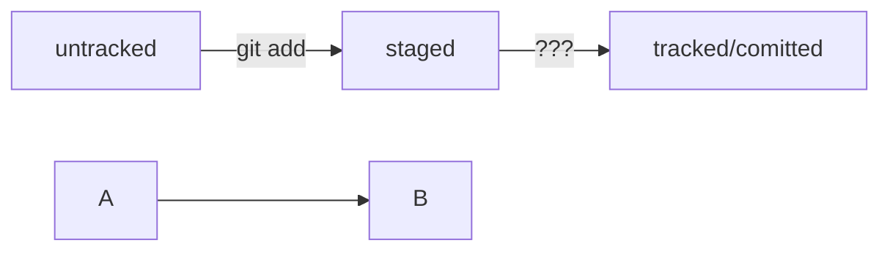

%% комментарий 

```mermaid
 graph LR;
  untracked -- "git add" --> staged;
  staged    -- "???"     --> tracked/comitted;

%% стрелка без текста для примера: 
  A --> B;
``` 

%% пример второй схемы

```mermaid
  graph TD;
      A-->B;
      A-->C;
      B-->D;
      C-->D;
```

